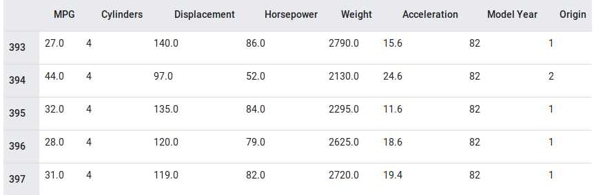

# Basic regression: Predict fuel efficiency with tf.js

In a regression problem, we aim to predict the output of a continuous value, like a price or a probability. Contrast this with a classification problem, where we aim to select a class from a list of classes (for example, where a picture contains an apple or an orange, recognizing which fruit is in the picture).

This example uses the [classic Auto MPG Dataset](https://archive.ics.uci.edu/ml/datasets/auto+mpg) and builds a model to predict the fuel efficiency of late-1970s and early 1980s automobiles. To do this, we'll provide the model with a description of many automobiles from that time period. This description includes attributes like: cylinders, displacement, horsepower, and weight.



This example uses ```tensorflow.js``` , see this guide for details.

> Done by Manuel Romero (mrm8488@gmail.com) | [@mrm8488 at Twitter](https://twitter.com/mrm8488)

> [Personal webpage](https://mrm8488.github.io/)